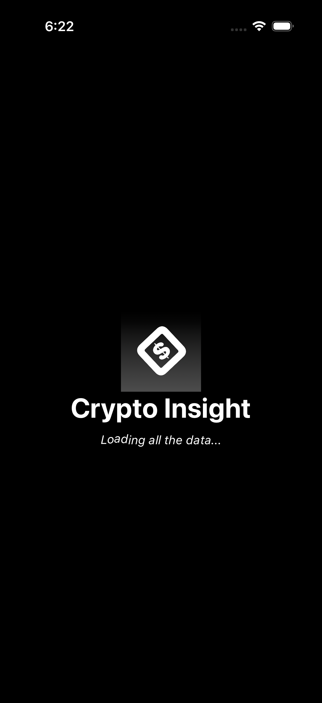
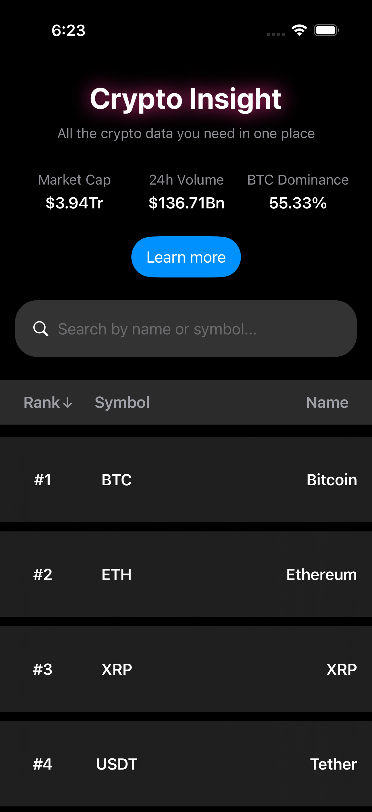
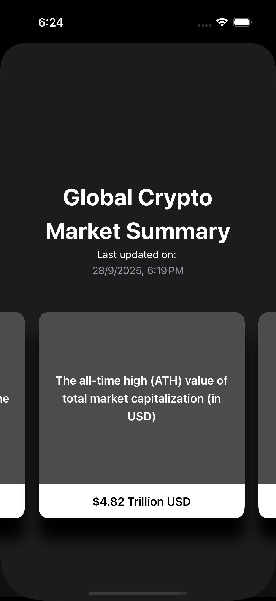
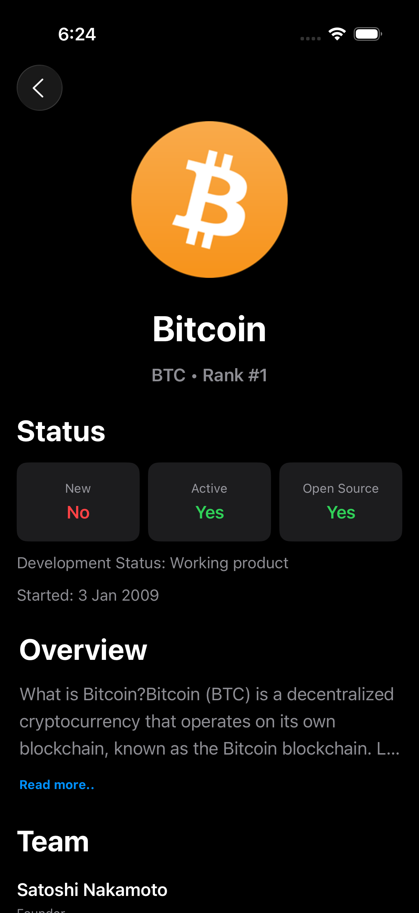
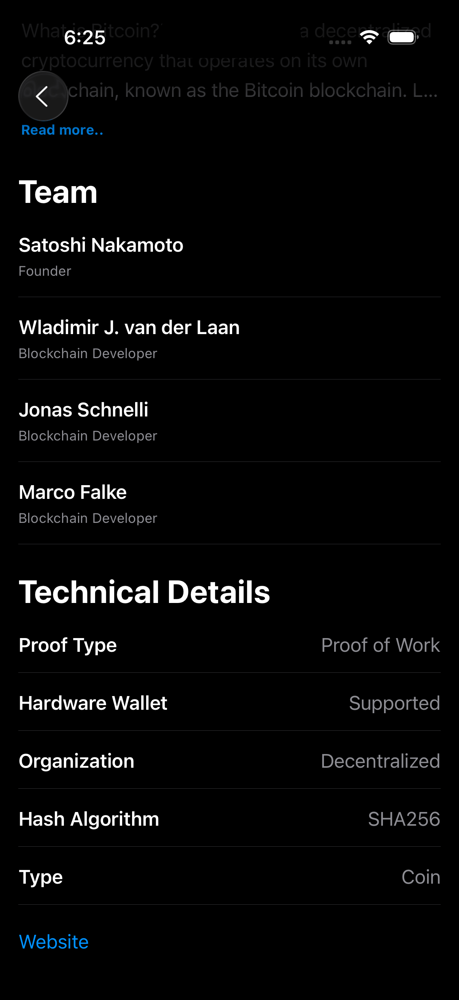

# 🚀 Crypto Insight

**Crypto Insight** is a modern, feature-rich iOS app that gives users a comprehensive and visually appealing way to explore the world of cryptocurrencies. It leverages real-time data from APIs to provide deep insights into coins, market trends, and technical details — all wrapped in a sleek interface that supports both dark and light modes.

---

## 📸 Features at a Glance

### 🖼️ Beautiful Launch Screen
- Smooth and engaging **launch screen animations** to give a premium feel from the first moment.

### 🏠 Home Screen
- Displays a **real-time list of all crypto coins**.
- Each row includes **rank, symbol, name**, and key info.
- Clean, minimal UI powered by **SwiftUI**.

### 📊 Market Overview
- A snapshot of the **global market**:
  - Total market cap
  - 24-hour volume
  - Bitcoin dominance
  - Number of listed coins
  - Always up-to-date via API integration.

### 📈 Market Details Screen
- Dive deeper into the market with a dedicated page for:
  - All-time highs
  - Volume history
  - Market cap trends
  - Real-time changes

### 🔍 Search & Sort
- Built-in **search box** to find coins by name or symbol.
- Sort coins by **rank** for quick access to the most relevant ones.

### 🪙 Coin Detail View
Tap any coin to explore detailed information:
- Coin **image/logo**
- Live **status**, **rank**, and activity info
- **Rich description**, parsed from HTML into clean text
- **Team details**: developers, founders, and contributors
- **Technical specs**:
  - Hashing algorithm
  - Proof type
  - Organization structure
  - Hardware wallet support
- Link to **official website**

### 🌙 Dark & Light Mode
- Full support for both **dark** and **light** appearance modes using system settings.

---

## 🔧 Tech Stack

| Component      | Technology            |
|----------------|-----------------------|
| Language       | Swift                 |
| UI Framework   | SwiftUI               |
| Architecture   | MVVM                  |
| Networking     | `URLSession` + Generics|
| Parsing        | Codable               |
| Data Source    | [CoinPaprika API](https://coinpaprika.com/api/) |

---

## 📡 API Usage

All data in the app is fetched live using public endpoints from **CoinPaprika API**, including:

- Coin list
- Global market stats
- Coin-specific details (team, links, description, etc.)

> ⚠️ Be mindful of rate limits on the free tier. Consider caching responses or upgrading your plan for production apps.

---

## 📸 Screenshots

<table>
  <tr>
      <td align="center">
      <strong>Launch Screen</strong> 
      
    </td>
    <td align="center">
      <strong>Home Screen</strong> 
      
    </td>
    <td align="center">
      <strong>Global Market</strong> 
      
  </tr>
  <tr>
    <td align="center">
      <strong>Coin Details Screen</strong> 
      
    </td>
        <td align="center">
      <strong>Coin Details Screen</strong> 
      
    
  </tr>
</table>
